```matlab
clear all; close all;


a=imread('image777.jpg');
I=rgb2gray(a);
figure; imshow(I)
```

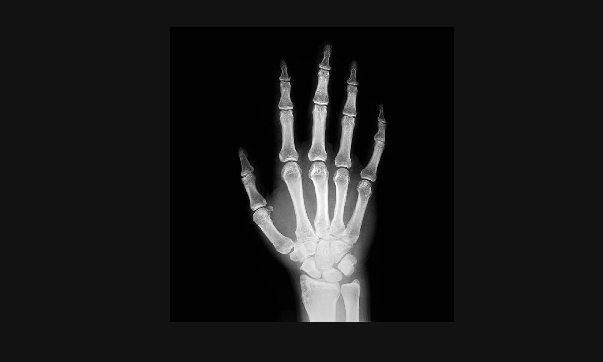

```matlab
II=I;
I=im2double(I);
R=size(a,1); C=size(a,2);
z=zeros(R,C);
```

# Random Number generation function

# Uniform Generator
```matlab
a1=0; b1=1;         % a1,b1 are parameters


w=rand(size(II));
Z1=(a1+w*(b1-a1));


ZZ1=(I+Z1);
```

# Gaussian Generator
```matlab
a2=0.5; b2=0.1;         % a2,b2 are parameters


Z2= a2 + randn(size(II)).*b2;
ZZ2=I + (a2 + randn(size(II)).*b2);
```

# Lognormal
```matlab
a3=0.5; b3=0.25;       % a3,b3 are parameters


Z3=a3*exp(b3*randn(size(II)));


ZZ3=I+Z3;
```

# Salt and Pepper
```matlab
a4=0.05; b4=0.05;         % a4,b4 are parameters
X=rand(size(II));
Z4=zeros(R,C)+0.5;
if a4+b4 <=1
  
for i=1:R
    for j=1:C
        
       if X(i,j) <=a4
           Z4(i,j)=0;
       elseif X(i,j)> a4 && X(i,j) <= a4+b4
           Z4(i,j)=1;
       end 
        
    end
end
    
     
end


ZZ4=Z4+I;
```

# Rayleigh
```matlab
a5=0; b5=0.2;
Z5=a5+(-b5*log(1-rand(R,C))).^0.5;
ZZ5=I+Z5.*I;
```

# Exponential Poisson
```matlab
a6=5; b6=0;


if a6>0
    
    k=-1/a6;
    Z6=k*log(1-rand(R,C));
    
end


ZZ6=I+Z6;
```

# Erlang
```matlab
a7=20; b7=5;
if b7>0
    k2=-1/a7;
    Z7=zeros(R,C);
    for j=1:b7
        Z7=Z7+ k2*log(1-rand(R,C));
    end
end


ZZ7=I+Z7;
```

# Uniform
```matlab
figure
subplot(2,3,1);imhist(I);title('Original Histogram','Fontsize', 6)
subplot(2,3,4);imshow(I);title('Original Image','Fontsize', 6)
subplot(2,3,3);imhist((ZZ1));title('Noise added Histogram','Fontsize', 6);ylim([0 10000])
subplot(2,3,6);imshow((ZZ1));title('Noise added Image','Fontsize', 6)
subplot(2,3,2);imhist((Z1));ylim([0 10000]);title('Uniform Noise Histogram','Fontsize', 6)
subplot(2,3,5);imshow((Z1));title('Uniform Noise','Fontsize', 6)
h=subtitle('Uniform Distribution');
set(h,'FontSize',10,'FontWeight','normal')
```

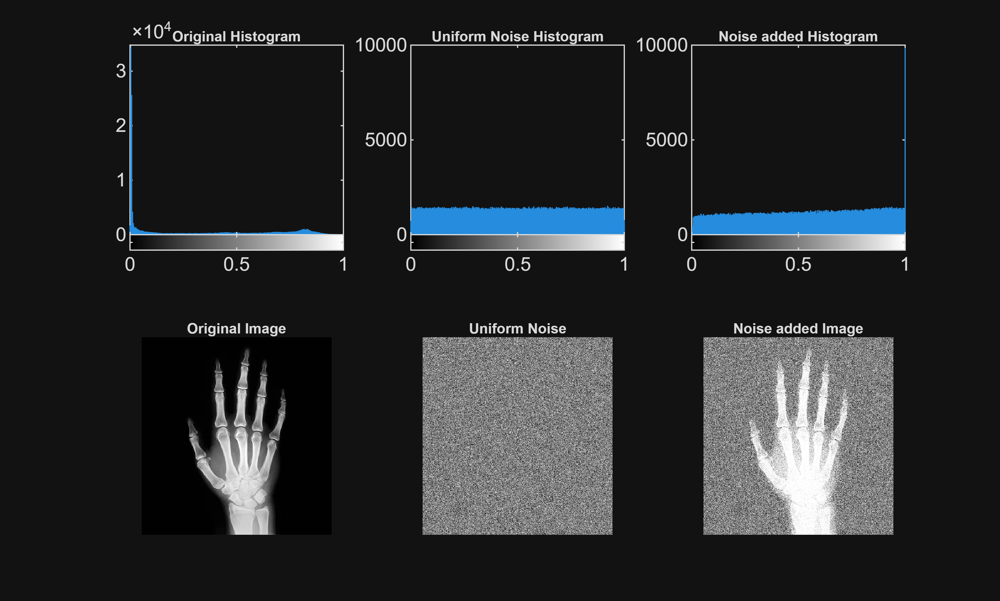

# Gaussian
```matlab
figure
subplot(2,3,1);imhist(II);title('Original Histogram','Fontsize', 6)
subplot(2,3,4);imshow(II);title('Original Image','Fontsize', 6)
subplot(2,3,3);imhist(ZZ2);title('Noise added Histogram','Fontsize', 6);ylim([0 10000])
subplot(2,3,6);imshow(ZZ2);title('Noise added Image','Fontsize', 6)
subplot(2,3,2);imhist(Z2);title('Gaussian Noise Histogram','Fontsize', 6);%ylim([0 10000])
subplot(2,3,5);imshow(Z2);title('Gaussian Noise','Fontsize', 6)
h=subtitle('Gaussian Distribution');
set(h,'FontSize',10,'FontWeight','normal')
```

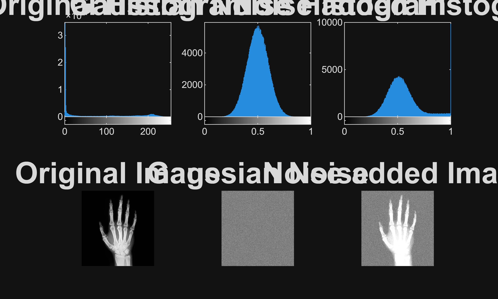

# Lognormal
```matlab
figure
subplot(2,3,1);imhist(II);title('Original Histogram','Fontsize', 6)
subplot(2,3,4);imshow(II);title('Original Image','Fontsize', 6)
subplot(2,3,3);imhist(ZZ3);title('Noise added Histogram','Fontsize', 6);ylim([0 10000])
subplot(2,3,6);imshow(ZZ3);title('Noise added Image','Fontsize', 6)
subplot(2,3,2);imhist(Z3);title('Lognormal Noise Histogram','Fontsize', 6);%ylim([0 10000])
subplot(2,3,5);imshow(Z3);title('Lognormal Noise','Fontsize', 6)
h=subtitle('Lognormal Distribution');
set(h,'FontSize',10,'FontWeight','normal')
```

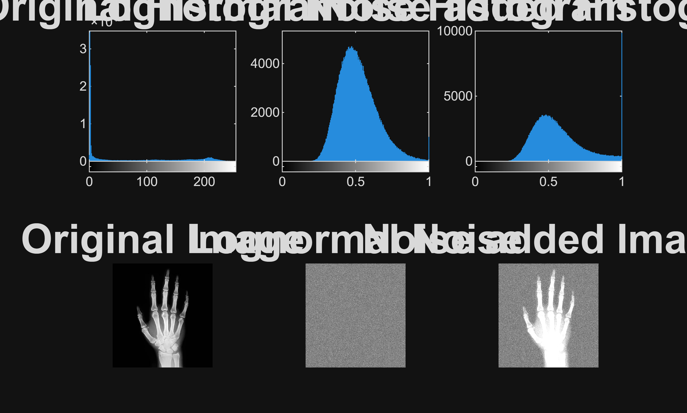

# Salt and Pepper
```matlab
figure
subplot(2,3,1);imhist(II);title('Original Histogram','Fontsize', 6)
subplot(2,3,4);imshow(II);title('Original Image','Fontsize', 6)
subplot(2,3,3);imhist(ZZ4);title('Noise added Histogram','Fontsize', 6);ylim([0 10000])
subplot(2,3,6);imshow(ZZ4);title('Noise added Image','Fontsize', 6)
subplot(2,3,2);imhist(Z4);title('Salt and Pepper Noise Histogram','Fontsize', 6);xlim([-0.1 1.1]);
subplot(2,3,5);imshow(Z4);title('Salt and Pepper Noise','Fontsize', 6)
h=subtitle('Salt and Pepper');
set(h,'FontSize',10,'FontWeight','normal')
```

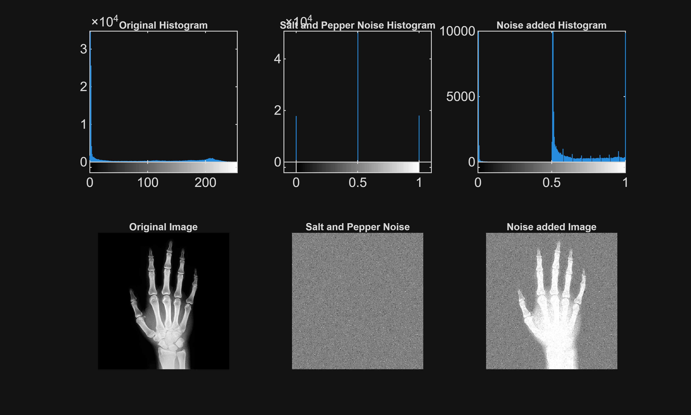

# Rayleigh (Speckle Noise)
```matlab
figure
subplot(2,3,1);imhist(II);title('Original Histogram','Fontsize', 6)
subplot(2,3,4);imshow(II);title('Original Image','Fontsize', 6)
subplot(2,3,3);imhist(ZZ5);title('Noise added Histogram','Fontsize', 6);ylim([0 10000])
subplot(2,3,6);imshow(ZZ5);title('Noise added Image','Fontsize', 6)
subplot(2,3,2);imhist(Z5);title('Speckle Noise Histogram','Fontsize', 6);
subplot(2,3,5);imshow(Z5);title('Speckle Noise','Fontsize', 6)
h=subtitle('Rayleigh DIstribution');
set(h,'FontSize',10,'FontWeight','normal')
```

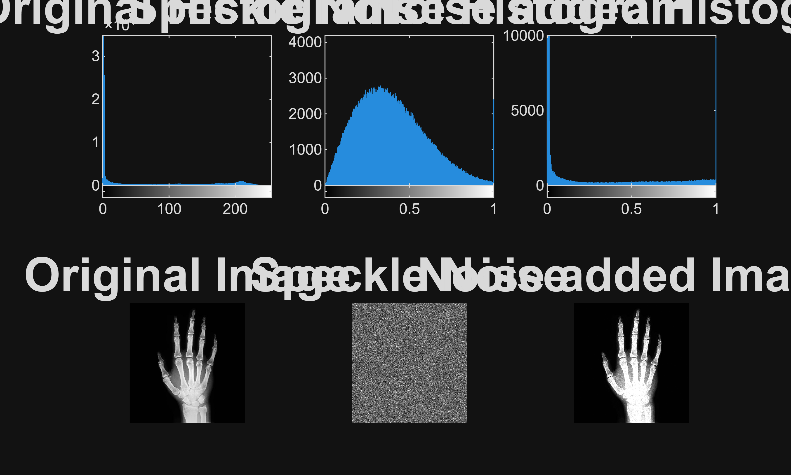

# Exponential (Shot Noise) Poisson Distribution
```matlab
figure
subplot(2,3,1);imhist(II);title('Original Histogram','Fontsize', 6)
subplot(2,3,4);imshow(II);title('Original Image','Fontsize', 6)
subplot(2,3,3);imhist(ZZ6);title('Noise added Histogram','Fontsize', 6);ylim([0 10000])
subplot(2,3,6);imshow(ZZ6);title('Noise added Image','Fontsize', 6)
subplot(2,3,2);imhist(Z6);title('Shot Noise Histogram','Fontsize', 6);
subplot(2,3,5);imshow(Z6);title('Shot Noise','Fontsize', 6)
h=subtitle('Poisson Distribution');
set(h,'FontSize',10,'FontWeight','normal')
```

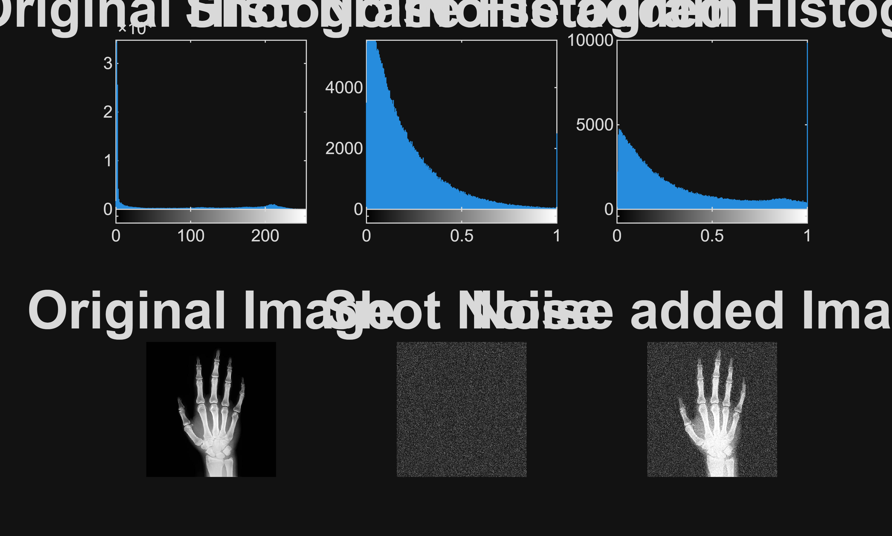

# Erlang Distribution
```matlab
figure
subplot(2,3,1);imhist(II);title('Original Histogram','Fontsize', 6)
subplot(2,3,4);imshow(II);title('Original Image','Fontsize', 6)
subplot(2,3,3);imhist(ZZ7);title('Noise added Histogram','Fontsize', 6);ylim([0 10000])
subplot(2,3,6);imshow(ZZ7);title('Noise added Image','Fontsize', 6)
subplot(2,3,2);imhist(Z7);title('Erlang Noise Histogram','Fontsize', 6);
subplot(2,3,5);imshow(Z7);title('Erlang Noise','Fontsize', 6)
h=subtitle('Erlang Distribution');
set(h,'FontSize',10,'FontWeight','normal')
```

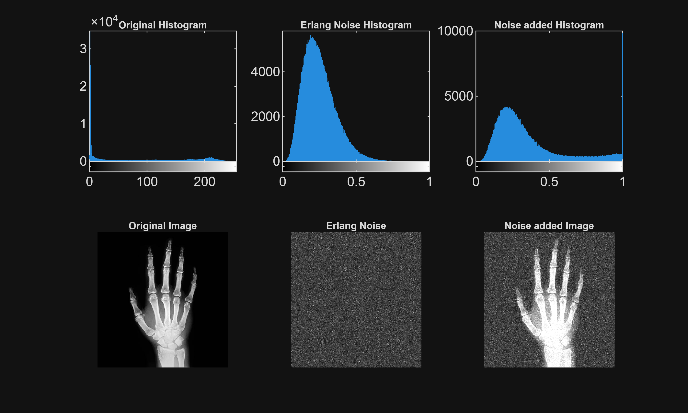

# Spatial Filtering

# Average FIlter
```matlab
r1=1/9.*[1 1 1;1 1 1;1 1 1];
l=zeros(R,C);
A1=convolution(r1,ZZ1,l,R,C);
A2=convolution(r1,ZZ2,l,R,C);
A3=convolution(r1,ZZ3,l,R,C);
A4=convolution(r1,ZZ4,l,R,C);
A5=convolution(r1,ZZ5,l,R,C);
A6=convolution(r1,ZZ6,l,R,C);
A7=convolution(r1,ZZ7,l,R,C);


figure;
subplot(1,2,1);imshow(ZZ1);title('Uniform Noise Image','Fontsize',6)
subplot(1,2,2);imshow(A1);title('Average Filtered Image (Uniform)','Fontsize',6)
```

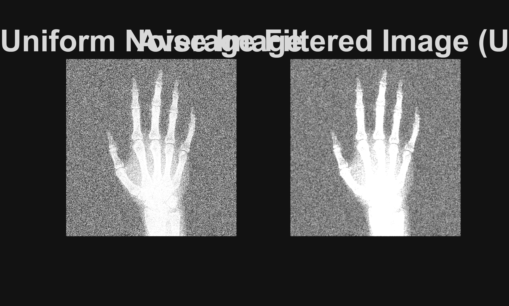

```matlab


figure;
subplot(3,2,1);imshow(ZZ2);title('Gaussian Noise Image','Fontsize',6)
subplot(3,2,2);imshow(A2);title('Average Filtered Image (Gaussian)','Fontsize',6)
subplot(3,2,3);imshow(ZZ3);title('Lognormal Noise Image','Fontsize',6)
subplot(3,2,4);imshow(A3);title('Average Filtered Image (Lognormal)','Fontsize',6)
subplot(3,2,5);imshow(ZZ4);title('Salt & Peppr Noise Image','Fontsize',6)
subplot(3,2,6);imshow(A4);title('Average Filtered Image (S & P)','Fontsize',6)
```

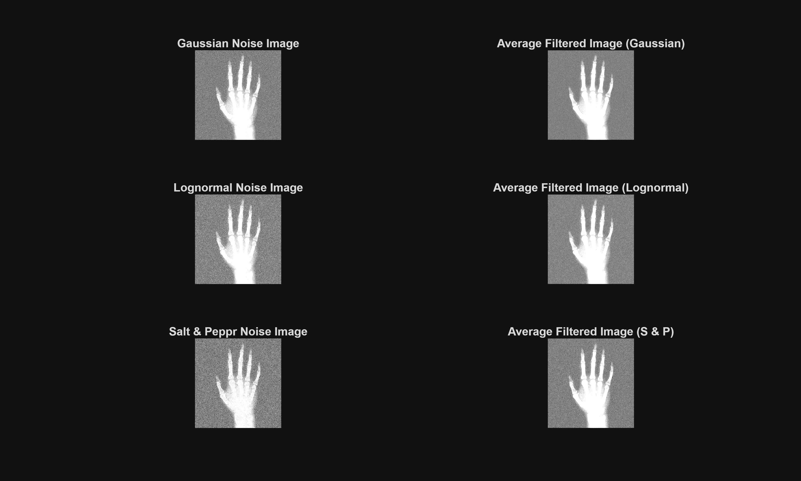

```matlab


figure;
subplot(3,2,1);imshow(ZZ5);title('Speckle Noise Image','Fontsize',6)
subplot(3,2,2);imshow(A5);title('Average Filtered Image (Speckle)','Fontsize',6)
subplot(3,2,3);imshow(ZZ6);title('Shot Noise Image','Fontsize',6)
subplot(3,2,4);imshow(A6);title('Average Filtered Image (Shot)','Fontsize',6)
subplot(3,2,5);imshow(ZZ7);title('Erlang Noise Image','Fontsize',6)
subplot(3,2,6);imshow(A7);title('Average Filtered Image (Erlang)','Fontsize',6)
```

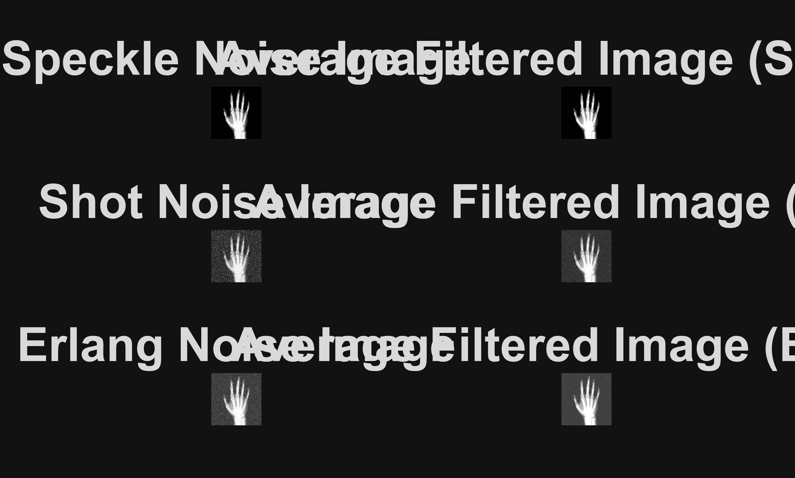

# Weighted Average Filter
```matlab
r2=1/16.*[1 2 1;2 4 2;1 2 1];
l2=zeros(R,C);
B1=convolution(r2,ZZ1,l2,R,C);
B2=convolution(r2,ZZ2,l2,R,C);
B3=convolution(r2,ZZ3,l2,R,C);
B4=convolution(r2,ZZ4,l2,R,C);
B5=convolution(r2,ZZ5,l2,R,C);
B6=convolution(r2,ZZ6,l2,R,C);
B7=convolution(r2,ZZ7,l2,R,C);


figure;
subplot(1,2,1);imshow(ZZ1);title('Uniform Noise Image','Fontsize',6)
subplot(1,2,2);imshow(B1);title('Weighted Average Filtered Image (Uniform)','Fontsize',6)
```

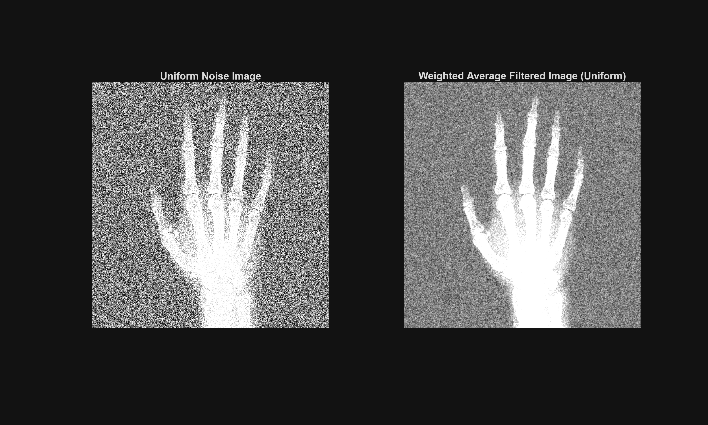

```matlab


figure;
subplot(3,2,1);imshow(ZZ2);title('Gaussian Noise Image','Fontsize',6)
subplot(3,2,2);imshow(B2);title('Weighted Average Filtered Image (Gaussian)','Fontsize',6)
subplot(3,2,3);imshow(ZZ3);title('Lognormal Noise Image','Fontsize',6)
subplot(3,2,4);imshow(B3);title('Weighted Average Filtered Image (Lognormal)','Fontsize',6)
subplot(3,2,5);imshow(ZZ4);title('Salt & Peppr Noise Image','Fontsize',6)
subplot(3,2,6);imshow(B4);title('Weighted Average Filtered Image (S & P)','Fontsize',6)
```

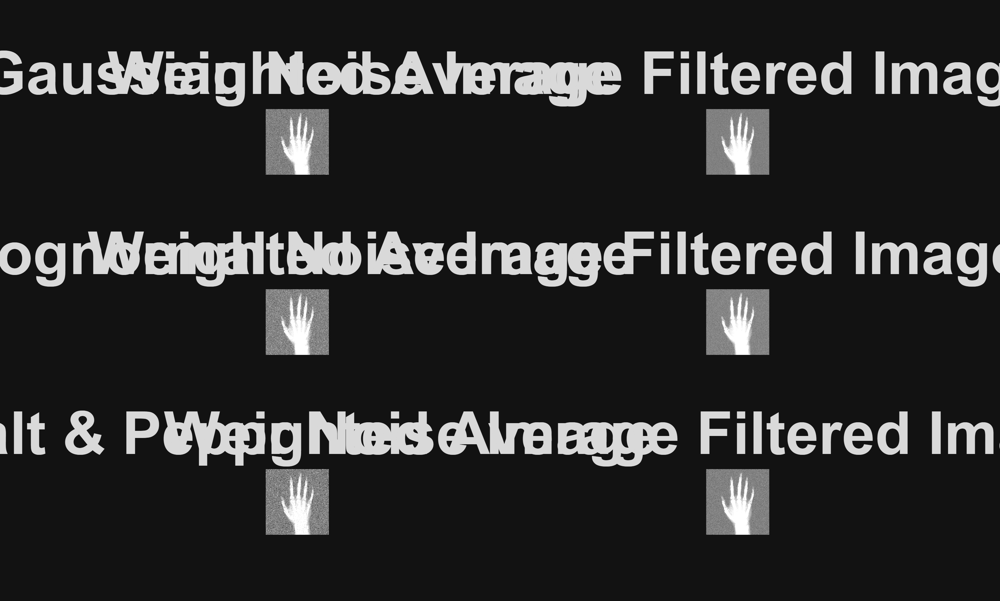

```matlab


figure;
subplot(3,2,1);imshow(ZZ5);title('Speckle Noise Image','Fontsize',6)
subplot(3,2,2);imshow(B5);title('Weighted Average Filtered Image (Speckle)','Fontsize',6)
subplot(3,2,3);imshow(ZZ6);title('Shot Noise Image','Fontsize',6)
subplot(3,2,4);imshow(B6);title('Weighted Average Filtered Image (Shot)','Fontsize',6)
subplot(3,2,5);imshow(ZZ7);title('Erlang Noise Image','Fontsize',6)
subplot(3,2,6);imshow(B7);title('Weighted Average Filtered Image (Erlang)','Fontsize',6)
```

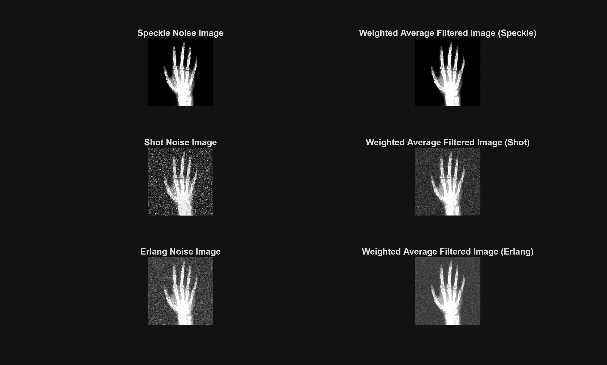

# Median Filter
```matlab
l3=zeros(R,C);
C1=Filter_median(ZZ1,l3,R,C);
C2=Filter_median(ZZ2,l3,R,C);
C3=Filter_median(ZZ3,l3,R,C);
C4=Filter_median(ZZ4,l3,R,C);
C5=Filter_median(ZZ5,l3,R,C);
C6=Filter_median(ZZ6,l3,R,C);
C7=Filter_median(ZZ7,l3,R,C);


figure;
subplot(1,2,1);imshow(ZZ1);title('Uniform Noise Image','Fontsize',6)
subplot(1,2,2);imshow(C1);title('Median Filtered Image (Uniform)','Fontsize',6)
```

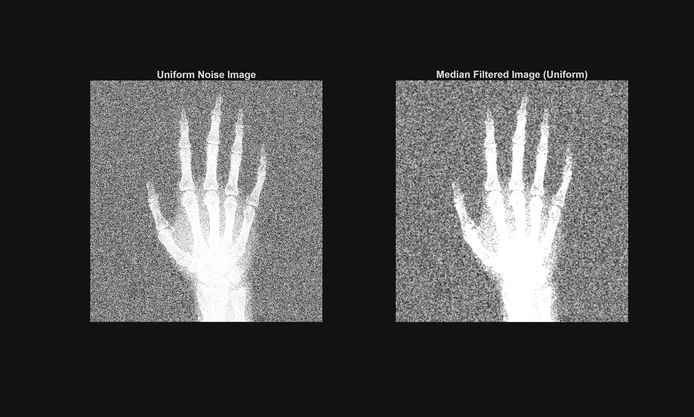

```matlab


figure;
subplot(3,2,1);imshow(ZZ2);title('Gaussian Noise Image','Fontsize',6)
subplot(3,2,2);imshow(C2);title('Median Filtered Image (Gaussian)','Fontsize',6)
subplot(3,2,3);imshow(ZZ3);title('Lognormal Noise Image','Fontsize',6)
subplot(3,2,4);imshow(C3);title('Median Filtered Image (Lognormal)','Fontsize',6)
subplot(3,2,5);imshow(ZZ4);title('Salt & Peppr Noise Image','Fontsize',6)
subplot(3,2,6);imshow(C4);title('Median Filtered Image (S & P)','Fontsize',6)
```


```matlab


figure;
subplot(3,2,1);imshow(ZZ5);title('Speckle Noise Image','Fontsize',6)
subplot(3,2,2);imshow(C5);title('Median Filtered Image (Speckle)','Fontsize',6)
subplot(3,2,3);imshow(ZZ6);title('Shot Noise Image','Fontsize',6)
subplot(3,2,4);imshow(C6);title('Median Filtered Image (Shot)','Fontsize',6)
subplot(3,2,5);imshow(ZZ7);title('Erlang Noise Image','Fontsize',6)
subplot(3,2,6);imshow(C7);title('Median Filtered Image (Erlang)','Fontsize',6)
```

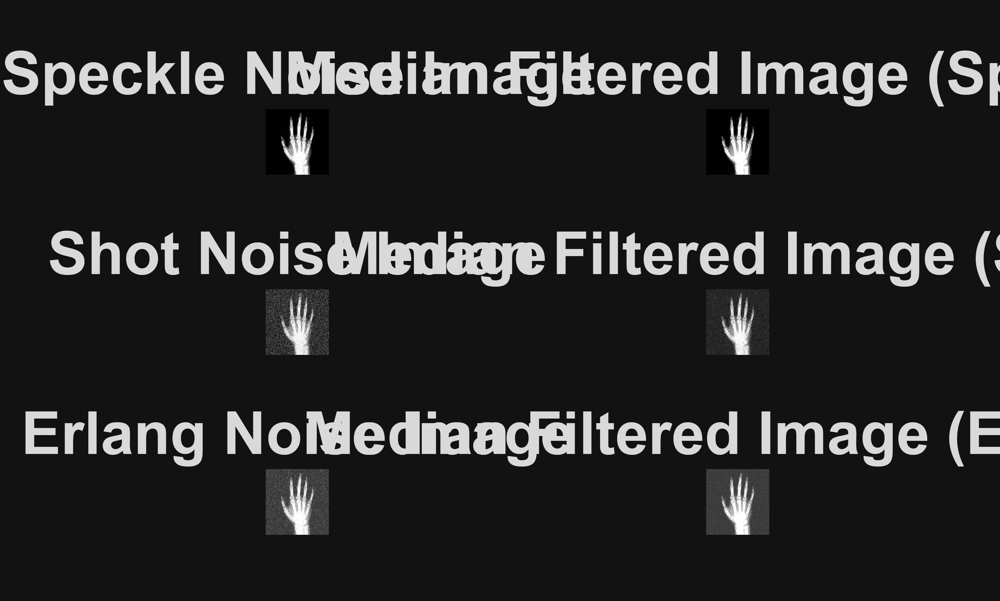

# Minimum Filter
```matlab
l4=zeros(R,C);
D1=Filter_minimum(ZZ1,l4,R,C);
D2=Filter_minimum(ZZ2,l4,R,C);
D3=Filter_minimum(ZZ3,l4,R,C);
D4=Filter_minimum(ZZ4,l4,R,C);
D5=Filter_minimum(ZZ5,l4,R,C);
D6=Filter_minimum(ZZ6,l4,R,C);
D7=Filter_minimum(ZZ7,l4,R,C);


figure;
subplot(1,2,1);imshow(ZZ1);title('Uniform Noise Image','Fontsize',6)
subplot(1,2,2);imshow(D1);title('Minimum Filtered Image (Uniform)','Fontsize',6)
```

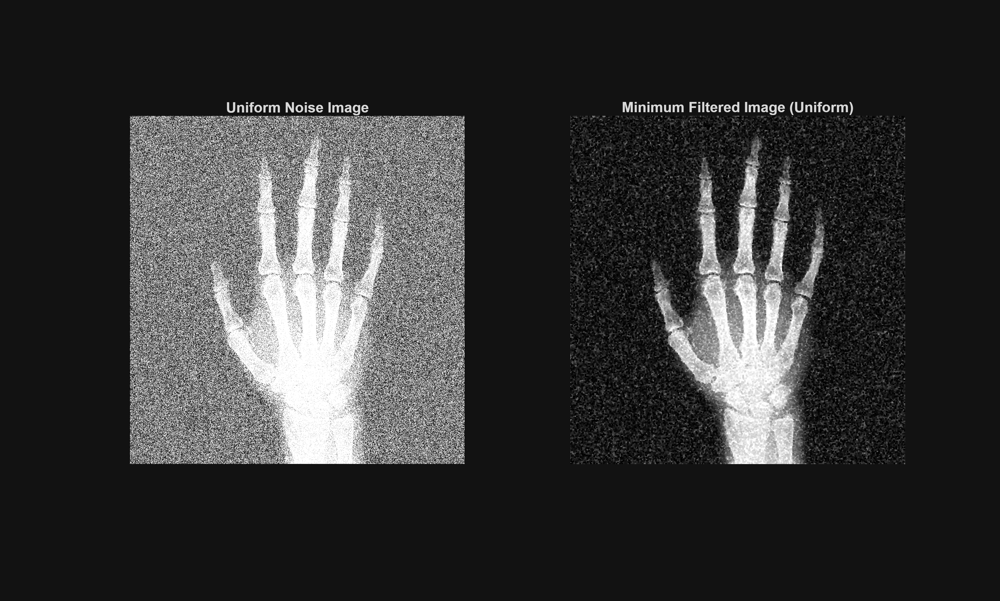

```matlab


figure;
subplot(3,2,1);imshow(ZZ2);title('Gaussian Noise Image','Fontsize',6)
subplot(3,2,2);imshow(D2);title('Minimum Filtered Image (Gaussian)','Fontsize',6)
subplot(3,2,3);imshow(ZZ3);title('Lognormal Noise Image','Fontsize',6)
subplot(3,2,4);imshow(D3);title('Minimum Filtered Image (Lognormal)','Fontsize',6)
subplot(3,2,5);imshow(ZZ4);title('Salt & Peppr Noise Image','Fontsize',6)
subplot(3,2,6);imshow(D4);title('Minimum Filtered Image (S & P)','Fontsize',6)
```

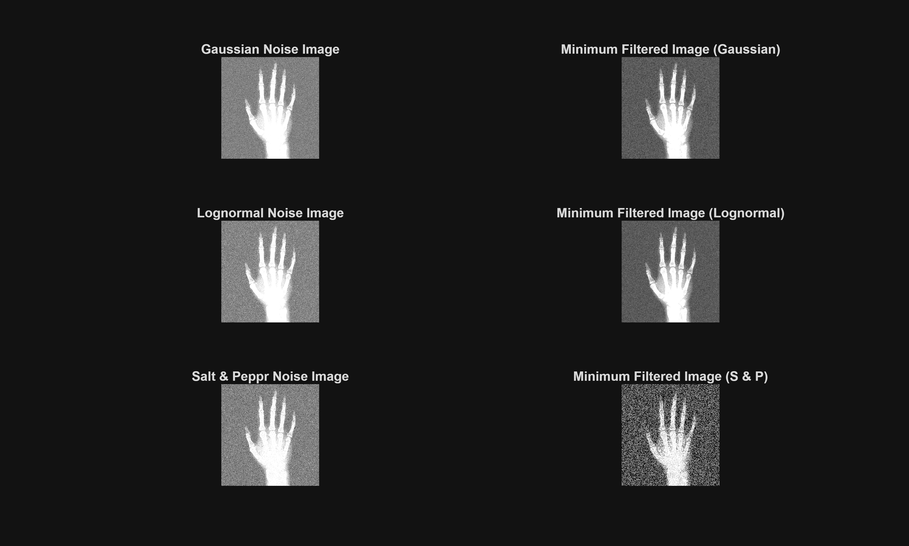

```matlab


figure;
subplot(3,2,1);imshow(ZZ5);title('Speckle Noise Image','Fontsize',6)
subplot(3,2,2);imshow(D5);title('Minimum Filtered Image (Speckle)','Fontsize',6)
subplot(3,2,3);imshow(ZZ6);title('Shot Noise Image','Fontsize',6)
subplot(3,2,4);imshow(D6);title('Minimum Filtered Image (Shot)','Fontsize',6)
subplot(3,2,5);imshow(ZZ7);title('Erlang Noise Image','Fontsize',6)
subplot(3,2,6);imshow(D7);title('Minimum Filtered Image (Erlang)','Fontsize',6)
```

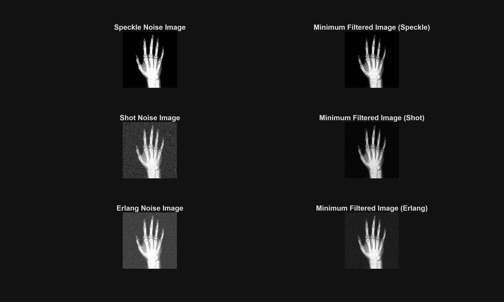

# Maximum Filter
```matlab
l5=zeros(R,C);
E1=Filter_maximum(ZZ1,l5,R,C);
E2=Filter_maximum(ZZ2,l5,R,C);
E3=Filter_maximum(ZZ3,l5,R,C);
E4=Filter_maximum(ZZ4,l5,R,C);
E5=Filter_maximum(ZZ5,l5,R,C);
E6=Filter_maximum(ZZ6,l5,R,C);
E7=Filter_maximum(ZZ7,l5,R,C);


figure;
subplot(1,2,1);imshow(ZZ1);title('Uniform Noise Image','Fontsize',6)
subplot(1,2,2);imshow(E1);title('Maximum Filtered Image (Uniform)','Fontsize',6)
```

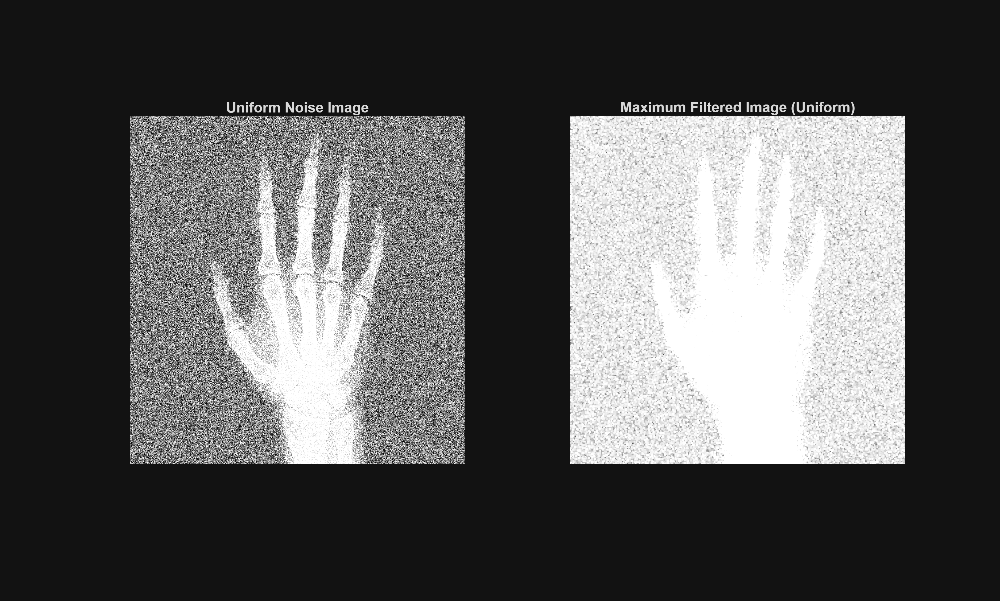

```matlab


figure;
subplot(3,2,1);imshow(ZZ2);title('Gaussian Noise Image','Fontsize',6)
subplot(3,2,2);imshow(E2);title('Maximum Filtered Image (Gaussian)','Fontsize',6)
subplot(3,2,3);imshow(ZZ3);title('Lognormal Noise Image','Fontsize',6)
subplot(3,2,4);imshow(E3);title('Maximum Filtered Image (Lognormal)','Fontsize',6)
subplot(3,2,5);imshow(ZZ4);title('Salt & Peppr Noise Image','Fontsize',6)
subplot(3,2,6);imshow(E4);title('Maximum Filtered Image (S & P)','Fontsize',6)
```


```matlab


figure;
subplot(3,2,1);imshow(ZZ5);title('Speckle Noise Image','Fontsize',6)
subplot(3,2,2);imshow(E5);title('Maximum Filtered Image (Speckle)','Fontsize',6)
subplot(3,2,3);imshow(ZZ6);title('Shot Noise Image','Fontsize',6)
subplot(3,2,4);imshow(E6);title('Maximum Filtered Image (Shot)','Fontsize',6)
subplot(3,2,5);imshow(ZZ7);title('Erlang Noise Image','Fontsize',6)
subplot(3,2,6);imshow(E7);title('Maximum Filtered Image (Erlang)','Fontsize',6)
```


# Function Blocks

# Convolution Function
```matlab
function l = convolution(c,e,l,R,C)


for i=1:R
    for j=1:C
        
        if i==1 && j==1
            l(i,j)=(c(2,2)*e(i,j)+c(2,3)*e(i,j+1)+c(3,2)*e(i+1,j)+c(3,3)*e(i+1,j+1));
        end
        
        if i==1 && j==C
            l(i,j)=(c(2,2)*e(i,j)+c(2,1)*e(i,j-1)+c(3,1)*e(i+1,j-1)+c(3,2)*e(i+1,j));
        end
        
        if i==R && j==1
            l(i,j)=(c(2,2)*e(i,j)+c(2,3)*e(i,j+1)+c(1,2)*e(i-1,j)+c(1,3)*e(i-1,j+1));
        end
        
        if i==R && j==C
            l(i,j)=(c(2,2)*e(i,j)+c(2,1)*e(i,j-1)+c(1,1)*e(i-1,j-1)+c(1,2)*e(i-1,j));
        end
         
        if i==1 && j>=2&&j<=C-1
            l(i,j)=(c(2,2)*e(i,j)+c(2,1)*e(i,j-1)+c(2,3)*e(i,j+1)+c(3,2)*e(i+1,j)+c(3,1)*e(i+1,j-1)+c(3,3)*e(i+1,j+1));
        end
        if i==R && j>=2&&j<=C-1
            l(i,j)=(c(2,2)*e(i,j)+c(2,1)*e(i,j-1)+c(2,3)*e(i,j+1)+c(1,2)*e(i-1,j)+c(1,1)*e(i-1,j-1)+c(1,3)*e(i-1,j+1));
        end
        if i>=2 && i<=R-1 && j==1
            l(i,j)=(c(2,2)*e(i,j)+c(1,2)*e(i-1,j)+c(3,2)*e(i+1,j)+c(2,3)*e(i,j+1)+c(1,3)*e(i-1,j+1)+c(3,3)*e(i+1,j+1));
        end
        if i>=2 && i<=R-1 && j==C
            l(i,j)=(c(2,2)*e(i,j)+c(1,2)*e(i-1,j)+c(3,2)*e(i+1,j)+c(2,1)*e(i,j-1)+c(1,1)*e(i-1,j-1)+c(3,1)*e(i+1,j-1));
        end
%         
%         
        if i>=2&&i<=R-1&&j>=2&&j<=C-1
            l(i,j)=(c(2,2)*e(i,j)+c(2,1)*e(i,j-1)+c(2,3)*e(i,j+1)+c(1,1)*e(i-1,j-1)+c(1,2)*e(i-1,j)+c(1,3)*e(i-1,j+1)+c(3,1)*e(i+1,j-1)+c(3,2)*e(i+1,j)+c(3,3)*e(i+1,j+1));
        end
    end  
end


end
```

# Median Filter function
```matlab
function k=Filter_median(e,k,R,C)


for i=1:R
    for j=1:C
      if i==1&&j==1
       k(i,j)=median([e(i,j) e(i,j+1) e(i+1,j) e(i+1,j+1)]);  
      end  
      if i==1&&j==C
          k(i,j)=median([e(i,j) e(i,j-1) e(i+1,j) e(i+1,j-1)]);
      end
      if i==R&&j==1
          k(i,j)=median([e(i,j) e(i,j+1) e(i-1,j) e(i-1,j+1)]);
      end
      if i==R&&j==C
          k(i,j)=median([e(i,j) e(i,j-1) e(i-1,j) e(i-1,j-1)]);
      end
      
      if i==1 && j>=2&&j<=C-1
          k(i,j)=median([e(i,j-1) e(i,j) e(i,j+1) e(i+1,j-1) e(i+1,j) e(i+1,j+1)]);
      end
      if i==R && j>=2&&j<=C-1
          k(i,j)=median([e(i,j-1) e(i,j) e(i,j+1) e(i-1,j-1) e(i-1,j) e(i-1,j+1)]);
      end
      if i>=2&&i<=R-1 && j==1
          k(i,j)=median([e(i,j) e(i+1,j) e(i-1,j) e(i,j+1) e(i-1,j+1) e(i+1,j+1)]);
      end
      if i>=2&&i<=R-1 && j==C
          k(i,j)=median([e(i,j) e(i+1,j) e(i-1,j) e(i,j-1) e(i-1,j-1) e(i+1,j-1)]);
      end
      
      if i>=2&&i<=R-1 && j>=2&&j<=C-1
          k(i,j)=median([e(i,j) e(i,j-1) e(i,j+1) e(i-1,j) e(i-1,j+1) e(i-1,j-1) e(i+1,j) e(i+1,j-1) e(i+1,j+1) ]);
      end
    end
end


end
```

# Minimum Filter function
```matlab
function k=Filter_minimum(e,k,R,C)


for i=1:R
    for j=1:C
      if i==1&&j==1
       k(i,j)=min([e(i,j) e(i,j+1) e(i+1,j) e(i+1,j+1)]);  
      end  
      if i==1&&j==C
          k(i,j)=min([e(i,j) e(i,j-1) e(i+1,j) e(i+1,j-1)]);
      end
      if i==R&&j==1
          k(i,j)=min([e(i,j) e(i,j+1) e(i-1,j) e(i-1,j+1)]);
      end
      if i==R&&j==C
          k(i,j)=min([e(i,j) e(i,j-1) e(i-1,j) e(i-1,j-1)]);
      end
      
      if i==1 && j>=2&&j<=C-1
          k(i,j)=min([e(i,j-1) e(i,j) e(i,j+1) e(i+1,j-1) e(i+1,j) e(i+1,j+1)]);
      end
      if i==R && j>=2&&j<=C-1
          k(i,j)=min([e(i,j-1) e(i,j) e(i,j+1) e(i-1,j-1) e(i-1,j) e(i-1,j+1)]);
      end
      if i>=2&&i<=R-1 && j==1
          k(i,j)=min([e(i,j) e(i+1,j) e(i-1,j) e(i,j+1) e(i-1,j+1) e(i+1,j+1)]);
      end
      if i>=2&&i<=R-1 && j==C
          k(i,j)=min([e(i,j) e(i+1,j) e(i-1,j) e(i,j-1) e(i-1,j-1) e(i+1,j-1)]);
      end
      
      if i>=2&&i<=R-1 && j>=2&&j<=C-1
          k(i,j)=min([e(i,j) e(i,j-1) e(i,j+1) e(i-1,j) e(i-1,j+1) e(i-1,j-1) e(i+1,j) e(i+1,j-1) e(i+1,j+1) ]);
      end
    end
end


end
```

# Maximum Filter function
```matlab
function k=Filter_maximum(e,k,R,C)


for i=1:R
    for j=1:C
      if i==1&&j==1
       k(i,j)=max([e(i,j) e(i,j+1) e(i+1,j) e(i+1,j+1)]);  
      end  
      if i==1&&j==C
          k(i,j)=max([e(i,j) e(i,j-1) e(i+1,j) e(i+1,j-1)]);
      end
      if i==R&&j==1
          k(i,j)=max([e(i,j) e(i,j+1) e(i-1,j) e(i-1,j+1)]);
      end
      if i==R&&j==C
          k(i,j)=max([e(i,j) e(i,j-1) e(i-1,j) e(i-1,j-1)]);
      end
      
      if i==1 && j>=2&&j<=C-1
          k(i,j)=max([e(i,j-1) e(i,j) e(i,j+1) e(i+1,j-1) e(i+1,j) e(i+1,j+1)]);
      end
      if i==R && j>=2&&j<=C-1
          k(i,j)=max([e(i,j-1) e(i,j) e(i,j+1) e(i-1,j-1) e(i-1,j) e(i-1,j+1)]);
      end
      if i>=2&&i<=R-1 && j==1
          k(i,j)=max([e(i,j) e(i+1,j) e(i-1,j) e(i,j+1) e(i-1,j+1) e(i+1,j+1)]);
      end
      if i>=2&&i<=R-1 && j==C
          k(i,j)=max([e(i,j) e(i+1,j) e(i-1,j) e(i,j-1) e(i-1,j-1) e(i+1,j-1)]);
      end
      
      if i>=2&&i<=R-1 && j>=2&&j<=C-1
          k(i,j)=max([e(i,j) e(i,j-1) e(i,j+1) e(i-1,j) e(i-1,j+1) e(i-1,j-1) e(i+1,j) e(i+1,j-1) e(i+1,j+1) ]);
      end
    end
end


end
```